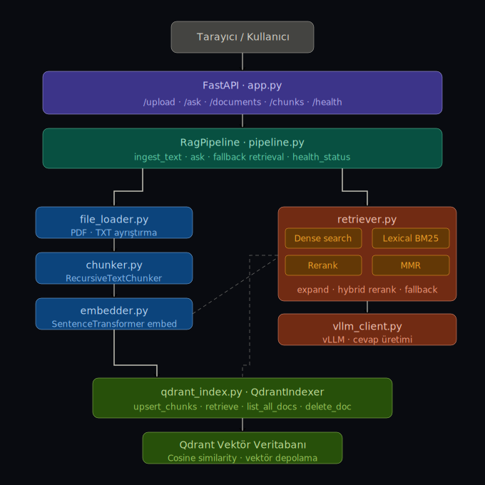

# RAG + RAGAS Evaluation System

PDF ve metin dosyalarını yükleyip doğal dil soruları sormanı sağlayan, hibrit retrieval ve RAGAS tabanlı otomatik değerlendirme pipeline'ına sahip bir RAG sistemi.

---

## Mimari



---

## Özellikler

- **Dosya yükleme** — PDF ve TXT desteği, otomatik chunk'lama
- **Hibrit arama** — Dense (vektör) + BM25 (lexical) + Rerank + MMR
- **vLLM entegrasyonu** — yerel LLM üzerinden cevap üretimi
- **RAGAS değerlendirme** — faithfulness, answer relevancy, context precision otomatik ölçümü
- **Multi-doc** — birden fazla belge aynı anda indexlenebilir

---

## Hızlı Başlangıç

```bash
# Qdrant'ı başlat
docker compose up -d

# Bağımlılıkları kur
pip install -r requirements.txt

# Sunucuyu çalıştır
uvicorn rag_mvp.app:app --reload
```

Tarayıcıda `http://localhost:8000` adresini aç.

---

## API

| Endpoint | Açıklama |
|---|---|
| `POST /upload` | Dosya yükle ve indexle |
| `POST /ask` | Soru sor, cevap al |
| `GET /documents` | Yüklü belgeleri listele |
| `GET /chunks` | Chunk'ları görüntüle |
| `GET /health` | Sistem durumu |

---

## Değerlendirme

```bash
python run_evaluation.py
```

Sonuçlar `eval_results.csv` dosyasına yazılır.

---

## Teknolojiler

`FastAPI` · `Qdrant` · `SentenceTransformers` · `vLLM` · `RAGAS` · `Docker`
